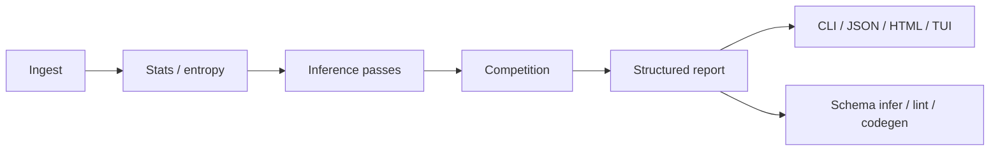

<p align="center">
  
</p>

```
 __        ___ ____  _____ _____  _    ____
 \ \      / (_|  _ \| ____|_   _|/ \  |  _ \
  \ \ /\ / /| | |_) |  _|   | | / _ \ | |_) |
   \ V  V / | |  _ <| |___  | |/ ___ \|  __/
    \_/\_/  |_|_| \_\_____| |_/_/   \_\_|
```

# Wiretap

**Evidence-backed binary protocol inference — offline, deterministic, explainable**

[](https://github.com/theworker02/wiretap/actions/workflows/ci.yml)
[](https://go.dev/)
[](CHANGELOG.md)
[](LICENSE)
[](https://goreportcard.com/report/github.com/theworker02/wiretap)

Built by **[@theworker02](https://github.com/theworker02)** — independent tooling for
authorized binary-format analysis. Hex viewers show bytes. Wiretap asks what
those bytes might mean, and shows the evidence.

```text
$ wiretap analyze examples/mystery/captures.hex
Wiretap Analysis Report
  length @ 0x04     confidence=High
  checksum trailer  confidence=High
  …
```

No LLM APIs. No telemetry. If evidence is thin, Wiretap says **Insufficient evidence**.

---


## Table of contents

- [Install](#install)
- [Quick start](#quick-start)
- [What Wiretap does](#what-wiretap-does)
- [CLI](#cli)
- [Projects & workflows](#projects--workflows)
- [Library](#library)
- [Architecture](#architecture)
- [Examples](#examples)
- [Security & privacy](#security--privacy)
- [Docs & site](#docs--site)
- [Contributing](#contributing)
- [License](#license)


## Install

```bash
git clone https://github.com/theworker02/wiretap.git
cd wiretap
go build -o bin/wiretap ./cmd/wiretap
```

Optional ldflags for release metadata:

```bash
go build -ldflags "-X github.com/theworker02/wiretap/pkg/wiretap.Version=0.4.0" -o bin/wiretap ./cmd/wiretap
```

Requires **Go 1.23+**. See [docs/windows.md](docs/windows.md) on Windows.

## Quick start

```bash
wiretap doctor
wiretap catalog
wiretap analyze examples/mystery/captures.hex
wiretap stats examples/mystery/captures.hex --limit 16
wiretap summary examples/mystery/captures.hex
wiretap explain --at field:0 examples/mystery/captures.hex
wiretap visualize examples/mystery/captures.hex -o map.svg
```

PowerShell demo: `scripts/demo.ps1` · Unix: `scripts/demo.sh`

## What Wiretap does


| You have                                                          | Wiretap produces                                      |
| ----------------------------------------------------------------- | ----------------------------------------------------- |
| Hex dumps, `.bin` files, PCAP payloads you are authorized to hold | Competing field hypotheses with confidence + evidence |
| Labelled sample pairs (`temp=20`, `temp=21`)                      | Differential / correlation reports                    |
| A confirmed schema                                                | Validation, Go / Kaitai / Wireshark stubs             |
| A checkout of this repo                                           | Example catalog, eval harness, docs site              |


**Always distinguished:** observation · hypothesis · confidence · evidence.

### Inference (merged product surface)

Byte statistics, entropy regions, constants, integers & endianness, length fields,
counters, checksums/CRCs, strings, bitfields, structured patterns (IPv4/MAC/UUID
as *patterns*), timestamps, arrays/TLV/varint/nested heuristics, clustering,
competition prune, schema infer/lint/validate/codegen, HTML/JSON/SVG/Mermaid
reports, TUI, projects, annotations, notes, indexing, authorized capture ingest.

## CLI

Commands are grouped in `wiretap --help`:


| Group        | Commands                                                                                                                                                                                                                                                   |
| ------------ | ---------------------------------------------------------------------------------------------------------------------------------------------------------------------------------------------------------------------------------------------------------- |
| **Analysis** | `analyze`, `summary`, `stats`, `dump`, `format`, `hypotheses`, `explain`, `inspect`, `diff`, `correlate`, `cluster`, `entropy`, `checksum`, `strings`, `timestamps`, `fingerprint`, `export`, `eval`, `experiment`, `tui`, `visualize`, `report`, `replay` |
| **Project**  | `init`, `project`, `sample`, `annotate`, `note`                                                                                                                                                                                                            |
| **Schema**   | `schema`, `validate`, `lint`, `generate`, `compare-schemas`                                                                                                                                                                                                |
| **Capture**  | `index`, `watch`, `capture`                                                                                                                                                                                                                                |
| **Tooling**  | `catalog`, `passes`, `config`, `env`, `doctor`, `docs`, `about`, `completion`, `help-all`, `version`                                                                                                                                                       |


```bash
wiretap format --hex "8a:01:00:0c"
wiretap lint draft.yaml
wiretap catalog
wiretap sample list          # inside a project
wiretap project status
```


## Projects & workflows

```bash
wiretap init my-proto && cd my-proto
wiretap sample add ../a.bin --label mode=idle
wiretap sample add ../b.bin --label mode=active
wiretap analyze
wiretap diff --label mode
wiretap annotate --offset 0 --length 2 --label magic --kind constant
wiretap schema infer -o schemas/draft.yaml
wiretap lint schemas/draft.yaml
wiretap generate go schemas/draft.yaml -o gen/
```

Annotations are **trusted evidence** and are never auto-overwritten. Conflicts
surface as warnings.

## Library

```go
import (
    "context"
    _ "github.com/theworker02/wiretap/internal/analysis"
    _ "github.com/theworker02/wiretap/internal/capture"
    wt "github.com/theworker02/wiretap/pkg/wiretap"
)

ds, err := wt.LoadPath("captures.hex", wt.IngestOptions{OnePerLine: true})
res, err := wt.Analyze(context.Background(), ds, wt.AnalyzeOptions{Budget: wt.BudgetNormal})
```

Module: `github.com/theworker02/wiretap` · example: `[examples/library](examples/library)`

## Architecture




| Path                 | Role                                  |
| -------------------- | ------------------------------------- |
| `cmd/wiretap`        | CLI                                   |
| `pkg/wiretap`        | Public API                            |
| `internal/analysis`  | Pipeline                              |
| `internal/inference` | Passes                                |
| `internal/capture`   | Hex / binary / PCAP ingest            |
| `internal/compare`   | Differentials                         |
| `internal/cluster`   | Clustering                            |
| `internal/project`   | Projects, samples, annotations, notes |
| `internal/report`    | Text / JSON / HTML + report cache     |
| `internal/eval`      | Synth corpus + measured metrics       |
| `internal/tui`       | Interactive browser                   |
| `internal/visualize` | SVG / Mermaid / Graphviz              |
| `internal/index`     | On-disk sample index                  |
| `schema`             | AST, lint, validate, codegen          |


Pipeline stages are first-class — not bolted-on “phases.” Budgets (`quick` /
`normal` / `exhaustive`) tune depth inside the same engine.

## Examples

```bash
wiretap catalog
```


| ID            | Path                                               |
| ------------- | -------------------------------------------------- |
| mystery       | `[examples/mystery](examples/mystery)`             |
| thermostat    | `[examples/thermostat](examples/thermostat)`       |
| tlv           | `[examples/tlv](examples/tlv)`                     |
| array_records | `[examples/array_records](examples/array_records)` |
| library       | `[examples/library](examples/library)`             |


## Security & privacy

- **Authorized use only** — interoperability, debugging, migration, preservation,
authorized research. See [SECURITY.md](SECURITY.md) and
[docs/capture-ethics.md](docs/capture-ethics.md).
- **Acquisition ≠ analysis** — PCAP/drop-folder helpers load operator-provided
files; they do not MITM or open live sniffers by default.
- **Privacy** — offline, no telemetry, no cloud model calls.


## Docs & site

- Docs index: `[docs/](docs/)`
- Static site: `[docs-site/](docs-site/)` (GitHub Pages workflow included)
- Brand: `[docs/brand.md](docs/brand.md)` · assets: `[assets/](assets/)`
- Org: `[ORGANIZATION.md](ORGANIZATION.md)`

```bash
wiretap docs architecture
wiretap completion powershell > wiretap.ps1
```


## Contributing

See [CONTRIBUTING.md](CONTRIBUTING.md) and [CODE_OF_CONDUCT.md](CODE_OF_CONDUCT.md).

```bash
make test
make build
go test ./...
```

Funding: [GitHub Sponsors](https://github.com/sponsors/theworker02) ·
[thanks.dev](https://thanks.dev/u/gh/theworker02) ·
[`.github/FUNDING.yml`](.github/FUNDING.yml)

### Eval (measured, synthetic only)

```bash
wiretap eval --n 50 --budget normal --seed 1
```

Regression floors are enforced in tests. Do not treat synth scores as production
accuracy claims. Recent measured ballpark (seed=1, n=50, normal): precision ~0.83,
FPR ~0.17, recall 1.0 — see [docs/eval.md](docs/eval.md) and [CHANGELOG.md](CHANGELOG.md).

## License

Apache License 2.0 — see [LICENSE](LICENSE).

Cite via [CITATION.cff](CITATION.cff) when appropriate.